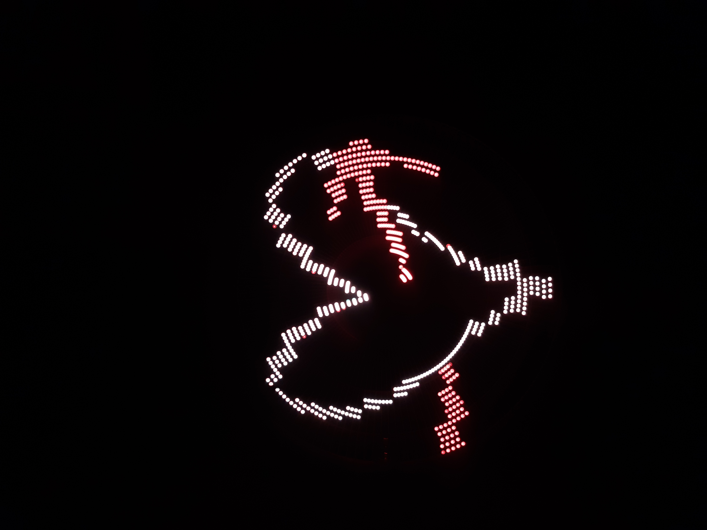
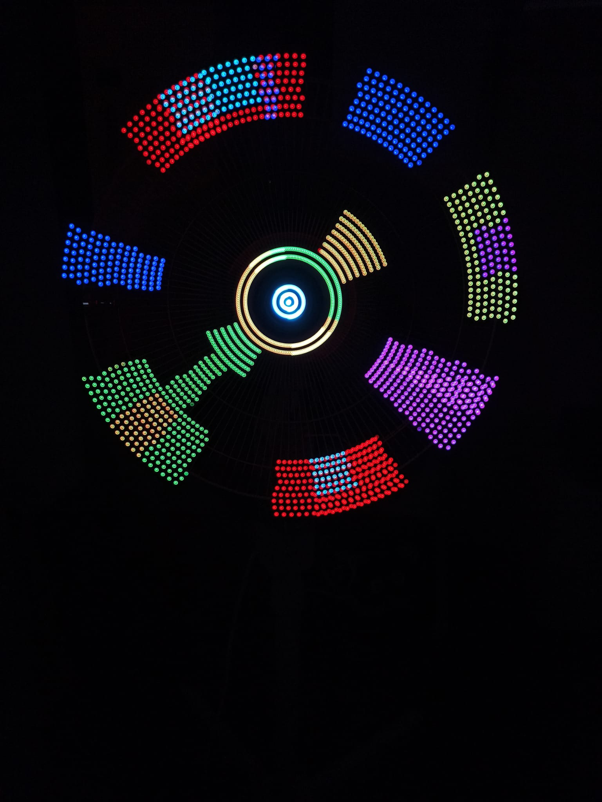

# Fan LED

POV display built on an Arduino-controlled fan. LEDs mounted on a spinning arm create persistent images through persistence of vision.

---

## How it works

A magnet is fixed to the outer edge of the fan. As the arm spins, a magnetic sensor detects each full rotation — giving the Arduino the current period and the arm's angular position at any instant. Knowing exactly where the arm is, the firmware fires each LED at the right moment so it always lights up at the same physical position, creating a stable image.

**Bonus:** a radio receiver module on the arm lets a second Arduino (connected to the PC via USB and a radio transmitter) send new image data wirelessly — so images can be changed from the computer in real time.

---

## Version 1 — Single LEDs

### Stick composition

<table width="100%">
<tr>
<td width="33%"></td>
<td width="33%"></td>
<td width="34%"></td>
</tr>
<tr>
<td align="center">LED strip</td>
<td align="center">Magnetic sensor</td>
<td align="center">Radio receiver</td>
</tr>
</table>

### Videos

<!-- upload quadrato_ruotante_3d.mp4 and replace URL -->
https://github.com/user-attachments/assets/QUADRATO_URL

<!-- upload pc_e_fanled_cuore.mp4 and replace URL -->
https://github.com/user-attachments/assets/PC_E_FANLED_CUORE_URL

<!-- upload pc_e_fanled.mp4 and replace URL -->
https://github.com/user-attachments/assets/PC_E_FANLED_URL

---

## Version 2 — LED strip

Single LEDs replaced by an addressable LED strip: more colors and higher pixel density. No photos of the setup, only the final results.

### Results

<table width="100%">
<tr>
<td width="33%"></td>
<td width="33%"></td>
<td width="34%"></td>
</tr>
</table>

<!-- upload cuore_v2.mp4 and replace URL -->
https://github.com/user-attachments/assets/CUORE_V2_URL
