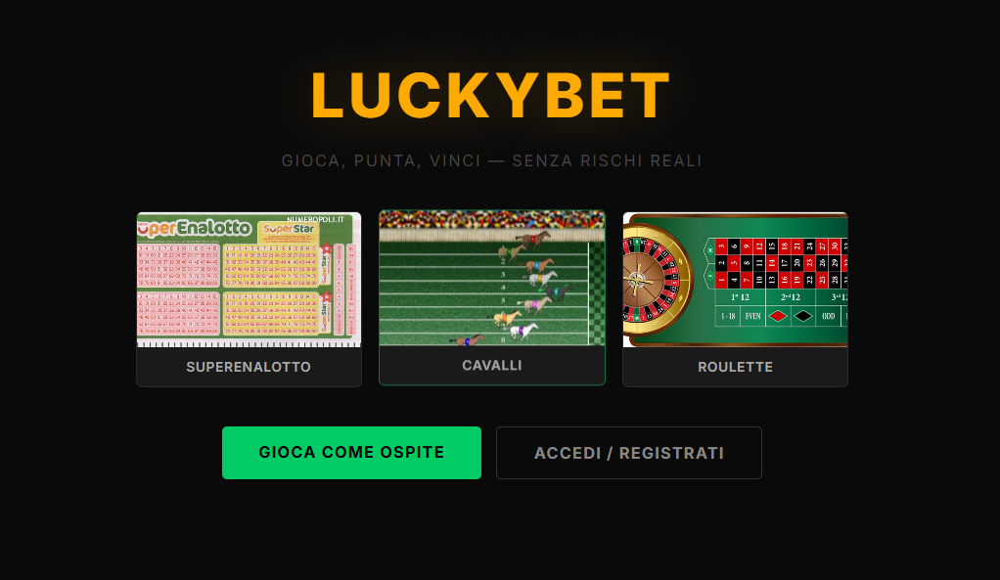
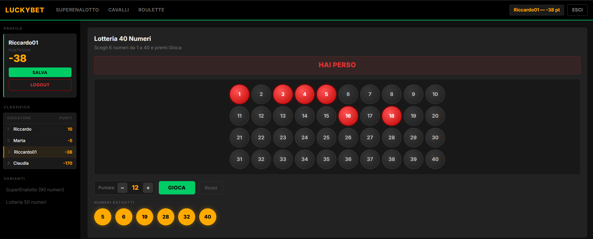
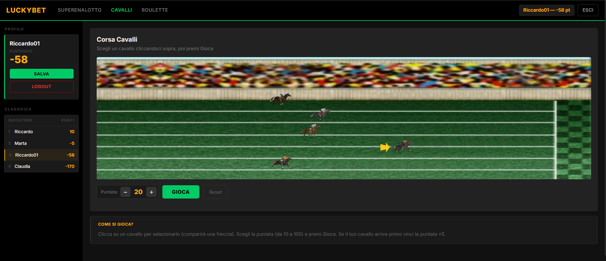
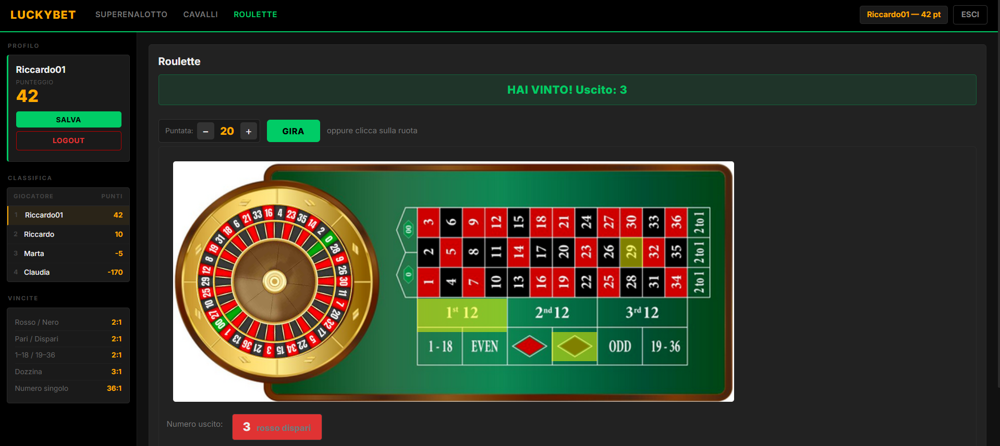

# LuckyBet

> A simulated gambling platform — no real money, just fun.
> High school project built with PHP, JavaScript, and pure CSS.

---






---

## Games

- **SuperEnalotto** — classic Italian lottery draw from 90 numbers
- **40-number Lottery** — pick 6 numbers out of 40
- **50-number Lottery** — wider pool variant
- **Horse Racing** — bet on a horse and watch the animated race
- **Roulette** — full betting table with single numbers, dozens, red/black, even/odd, 1–18 / 19–36

---

## Features

- User registration and login with PHP sessions
- **Guest mode** to play without an account
- Persistent score saved after each round
- **Live global leaderboard** in the sidebar
- Native JavaScript animations (spinning roulette wheel, moving horses)
- Dark responsive UI built entirely in vanilla CSS, no frameworks

---

## Tech stack

| Layer | Technologies |
|-------|-------------|
| Backend | PHP, MySQL |
| Frontend | HTML, CSS, JavaScript (vanilla) |
| Local server | XAMPP (Apache + MySQL) |

No external libraries, no frameworks — written from scratch.

---

## Run locally

1. Install [XAMPP](https://www.apachefriends.org/)
2. Clone the repo and place the `lucky-bet` folder inside `htdocs`:
   ```bash
   git clone https://github.com/Vriccardo01/lucky-bet.git
   ```
3. Start Apache and MySQL from the XAMPP control panel
4. Import the database (`db.sql`) via phpMyAdmin
5. Open `http://localhost/lucky-bet/index.php`

---

## Background

Built during high school as a full-stack exercise — covering PHP session management, vanilla JavaScript DOM manipulation, and CSS layout from scratch.
